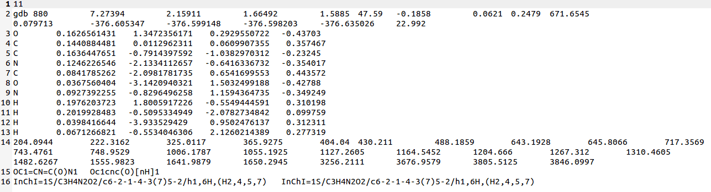
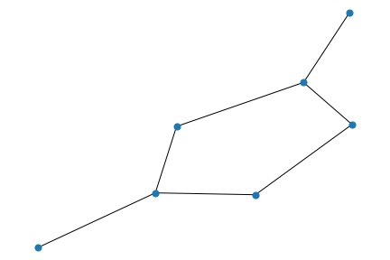

# CNN-in-QM9
Convolutional Neural Networks on images generated from QM9 dataset

The QM9 benchmark consists of 134k small organic molecules made up of **CHONF**. It has a total of 13 computed geometric, energetic, electric and thermodynamic properties for each molecule. The properties are reported with molecules being minimal in energy, corresponding harmonic frequencies, dipole moments, polarizabilities, along with energies, enthalpies, and free energies of atomization.  As such, this data set provides quantum chemical properties for a relevant, consistent, and comprehensive chemical space of small organic molecules.

## Heres what a sample .xyz file from QM9 dataset looks like: 



Among the information, it contains a number of atoms(line 1), cartesian coordinates for each atom(lines 3-13), the respective properties (lines 2,14,16) and the GDB-17 correspondent of the **SMILES** notation (line 15).

This repository contains the python script that uses [**RDKIT**!](https://www.rdkit.org/) (Open-Source Cheminformatics Software) to convert **10k** SMILES notated molecules to 2-D images used to train a **Convolutional Neural Network based Model**

## Heres the corresponding converted image: 



The corresponding model was trained on a single property namely **Potential energy** extracted out from the .xyz file.

## Heres the CNN model:

```python
model = Sequential()
model.add(Conv2D(32, (3, 3), input_shape=(64,64,3), activation='relu'))
model.add(MaxPool2D(pool_size=(2, 2)))
model.add(Dropout(0.2))
model.add(Conv2D(64, (3, 3),activation='relu'))
model.add(Conv2D(64, (3, 3), activation='relu'))
model.add(MaxPool2D(pool_size=(2, 2)))
model.add(Dropout(0.2))
model.add(Conv2D(128, (5, 5), activation='relu'))
model.add(MaxPool2D(pool_size=(2, 2)))
model.add(Dropout(0.2))
model.add(Flatten())
model.add(Dense(256, activation='relu'))
model.add(Dense(1, activation='linear'))
None
```

## Result:

```
Train on 9500 samples, validate on 500 samples
Epoch 1/10
9500/9500 [==============================] - 63s 7ms/step - loss: 11.6384 - val_loss: 19.7382
Epoch 2/10
9500/9500 [==============================] - 64s 7ms/step - loss: 11.8763 - val_loss: 18.7724
Epoch 3/10
9500/9500 [==============================] - 63s 7ms/step - loss: 11.5878 - val_loss: 13.7496
Epoch 4/10
9500/9500 [==============================] - 63s 7ms/step - loss: 11.6255 - val_loss: 15.5905
Epoch 5/10
9500/9500 [==============================] - 64s 7ms/step - loss: 11.7071 - val_loss: 14.9457
Epoch 6/10
9500/9500 [==============================] - 63s 7ms/step - loss: 11.6645 - val_loss: 14.3131
Epoch 7/10
9500/9500 [==============================] - 65s 7ms/step - loss: 11.5465 - val_loss: 18.6461
Epoch 8/10
9500/9500 [==============================] - 63s 7ms/step - loss: 11.3958 - val_loss: 15.3878
Epoch 9/10
9500/9500 [==============================] - 63s 7ms/step - loss: 11.5520 - val_loss: 23.4466
Epoch 10/10
9500/9500 [==============================] - 65s 7ms/step - loss: 11.3360 - val_loss: 14.0712
```

## Flaws in approach:

* **Loss of information**: The image does depict the model in two dimensions whereas the files do contain the cartesian coordinates for the 3-D structures. This accounts for the loss of information which could have been used in the structure of the model. 
* **Noise**: Using graphical image recognition to predict, the image contains too much white space which increases the noise in the data and hence errors. 